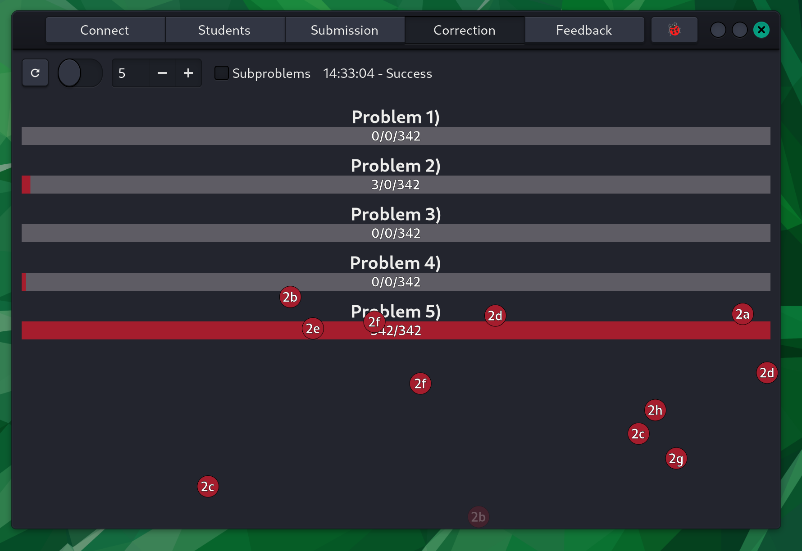
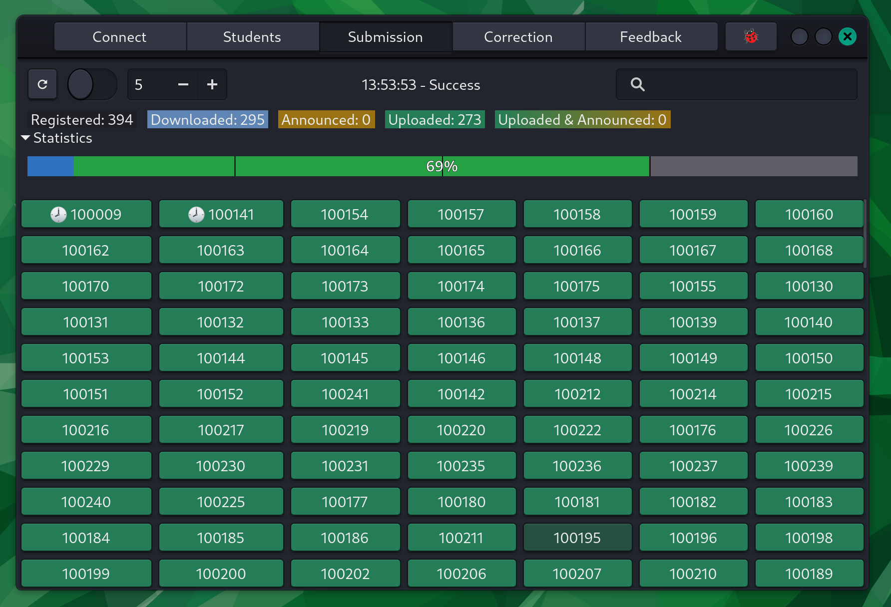
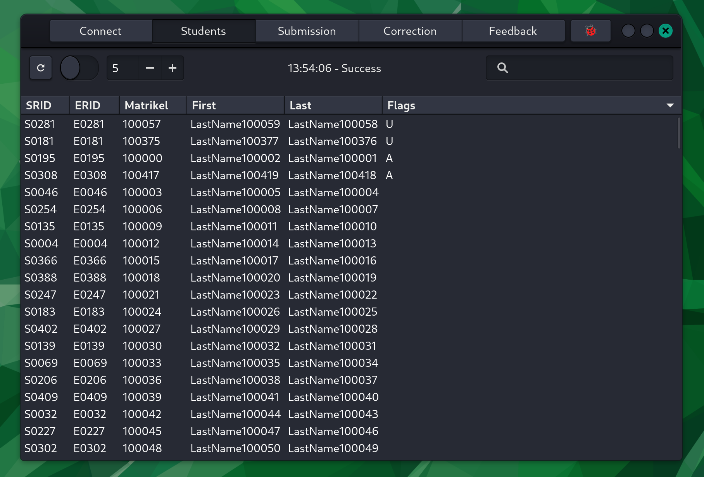
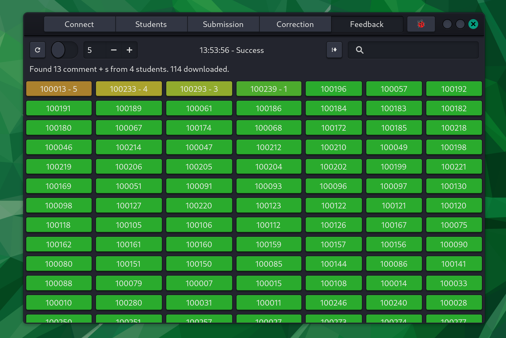

# TUMexam Client
C++ client for https://tumexam.de/ to manage students and exams.

## Examples









## Requirements

### Fedora
```
sudo dnf install gtkmm40-devel libcurl-devel gcc cmake git
```

### Debian/Ubuntu
```
sudo apt install libgtkmm-4.0-dev libcurl4-openssl-dev gcc cmake git
```

## Building
```
git clone https://github.com/COM8/tumexam-cli.git
cd tumexam-cli
mkdir build
cd build
cmake ..
cmake --build .
```

## Installing
```
sudo cmake --build . --target install
```

## Flatpak
The TUMexam client can be build and installed using Flatpak.
More instructions will follow shortly while I'm migrating the Flatpak repository to Flathub.
